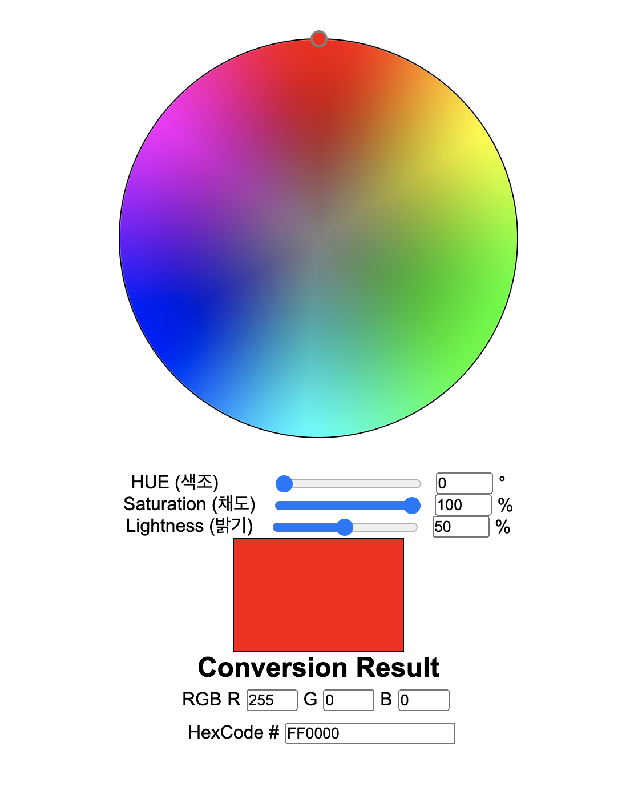
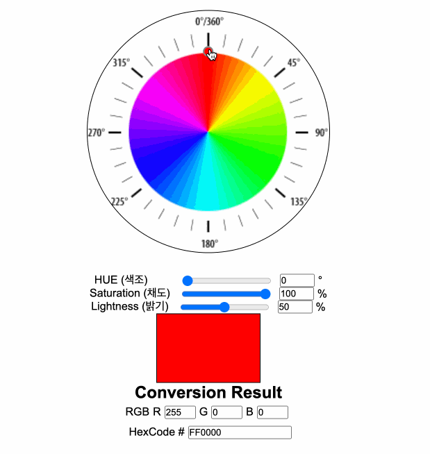

# Color Model Conversion

### Sangheon Kim (ksj8367@gmail.com)

- demo Video
  

## <a href="https://k4zo2.csb.app/" target="_blank">Demo</a>

## Version 1.0.3

### HSL To RGB and Hex Code

- [x] When Drag Change Color
- [x] When Click Change Color
- [x] HSL to RGB Conversion
- [x] Div Element BackGround Image Color Image to Canvas Elem (Add Canvas Script Code)
- [ ] Pick Color
- [ ] Add Conversion Code Copy Button

## Version History

- V 1.0.1

  - [x] When Click Change Color

- V 1.0.2

  - [x] When Drag Change Color
  - [x] HSL to RGB Conversion

- V 1.0.3
  - [x] Div Element BackGround Image Color Image to Canvas Elem (Add Canvas Script Code)

### Tech

- HTML
- CSS
- Javascript (No Module)
